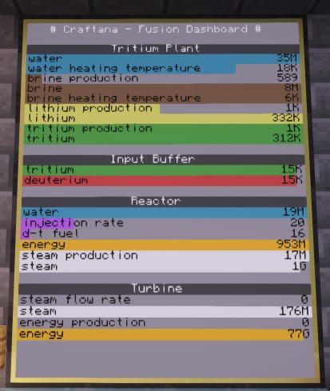
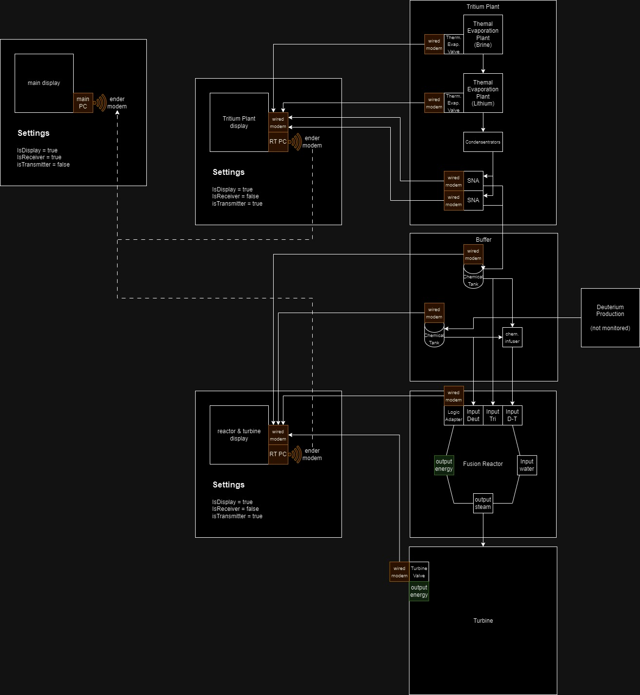

# FusionMon Dashboard

## Description

This Lua script is designed for use with the ComputerCraft and Mekanism mods in Minecraft.

It enables the monitoring of various Fusion-related Mekanism devices, providing information on inventory contents, production rates, and operational parameters.

Heavily inspired by: <https://pastebin.com/4XYCedMC>

## Features

- Monitor inventories of connected Mekanism devices.
- Display production rates and working parameters.
- Easy-to-read colored output on ComputerCraft monitors.

### Supported Mekanism devices

- Thermal Evaporation Plant (in/out/temp)
- Solar Neutron Activator (in/out/prod)
- Chemical Tank (content)
- Advanced Peripherals Tank (content)
- Fusion Reactor Logic Adapter (in:water,deu,tri,dtfuel/out:steam/prod:steam,energy/content:steam/inj-rate)
- Fusion Reactor Valve (optional, only for content:Energy)
- Turbine Valve (in:steamflow/prod:energy/content:steam,energy)

## Prerequisites

- Minecraft with the ComputerCraft and Mekanism mods installed.
- Computer with modems connected to the Mekanism Fusion-Plant devices you wish to monitor.
- a working Fusion Reactor (duh)

## Installation

### Drag-and-Drop

1. Open the computer terminal in Minecraft.
2. Drag and drop the Lua script file directly into the terminal window.
3. The file will be copied to the computer's file system.

### Pastebin

1. Use the `pastebin get <id> fusionmon` command in the ComputerCraft terminal where `<id>` is the Pastebin ID of the script.
2. The script will be downloaded and saved onto the computer's file system.

## Configuration

Configure the script by editing the settings within the script file to match your specific setup.

You will need to set the correct parameters for each connected computer.
Devices/Peripherals should be automatically detected and processed.

**The recommended "main" Monitor size for text-scale 1 is 4x5 (x,y).**
The transmitter Monitors are optional.

The amount of devices has no real limit, but at some point a single computer will take a long time processing all peripherals.

It is recommended to split-up large plants into multiple "Transmitter" Computers.

### Plant Layout example

### glhf
