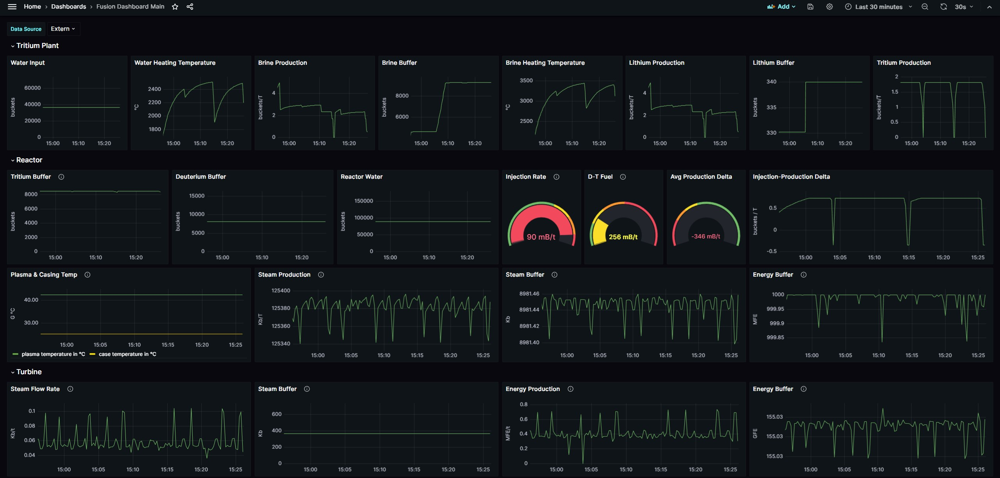

# FusionMon Dashboard


## Description

This Lua script is designed for use with the ComputerCraft (CC Tweaked) and Mekanism mods in Minecraft.

It enables the monitoring of various Fusion-related Mekanism devices, providing information on inventory contents, production rates, and operational parameters.

Heavily inspired by: <https://pastebin.com/4XYCedMC>

## Features

- Monitor inventories of connected Mekanism devices.
- Display production rates and working parameters.
- Easy-to-read colored output on ComputerCraft monitors.
- Highly dynamic and customizable layout, colors and settings.

## Dependencies

- Mekanism & Mekanism Generators, Version >= 10.4.5
- CC: Tweaked, Version >= 1.109.2

### Supported Mekanism devices

- Thermal Evaporation Plant (in/out/temp)
- Solar Neutron Activator (in/out/prod)
- Chemical Tank (content)
- Advanced Peripherals Tank (content)
- Fusion Reactor Logic Adapter (in:water,deu,tri,dtfuel/out:steam/prod:steam,energy/content:steam/inj-rate)
- Fusion Reactor Valve (optional, only for content:Energy)
- Turbine Valve (in:steamflow/prod:energy/content:steam,energy)

## Prerequisites

- a working Fusion Reactor (duh)
- Computer with modems connected to the devices you wish to monitor. See layout below.

### Plant Layout example


## Installation

### Drag-and-Drop

1. Open the computer terminal in Minecraft.
2. Drag and drop the Lua script file directly into the terminal window.
3. The file will be copied to the computer's file system.

### Pastebin

1. Use the `pastebin get <id> fusionmon` command in the ComputerCraft terminal where `<id>` is the Pastebin ID of the script.
2. The script will be downloaded and saved onto the computer's file system.

## Configuration

Configure the script by editing the settings within the script file to match your specific setup.

You will need to set the correct parameters for each connected computer.
Devices/Peripherals should be automatically detected and processed.

**The recommended "main" Monitor size for text-scale=1 and category-padding=1, is 4x5 (x,y).**

You can however also use category-padding=0 and print-version=false to cramp everything onto a 4x4 screen.

Monitors are optional, just set "IsDisplay=false".

The amount of devices has no real limit, but at some point a single computer will take a long time processing all of them.

Therefore it is recommended to split-up large plants into multiple "Transmitter" Computers.

## Grafana Monitoring

I would not say that you should do it, or that it makes any sense - but you definitely can.



**The server owner can see stored passwords and URLs in Clear-Text. He should be trustworthy to some degree.**

Anyone walking by the computer on an unprotected, public multiplayer server can also access its data.

So: **DO NOT USE IMPORTANT PASSWORDS. I DO NOT ACCEPT ANY RESPONSIBILITY.**

**If you dont know what docker is, you should really stop reading here and ignore this section.**

### Requirements

- ComputerCraft http api needs to be enabled
- running and configured Grafana and Prometheus instances
- reverse proxy with HTTP Basic Auth Support (e.g. traefik)

### Host a prometheus push-gateway with docker compose

Generate a basic auth hash using some website.

```yaml
    pushgateway:
        image: prom/pushgateway:latest
        container_name: pushgateway
        hostname: pushgateway
        restart: always
        networks:
            - metrics # same as prometheus, needed for scraping this container.
            - web # same as Traefik (your reverse proxy)
        labels:
            traefik.enable: "true"
            traefik.http.routers.pushgateway.rule: Host(`push-gateway.${HOST}`)
            traefik.http.routers.pushgateway.entrypoints: websecure
            traefik.http.routers.pushgateway.middlewares: pushgateway-chain
            traefik.http.routers.pushgateway.tls.certresolver: cfresolver
            traefik.http.routers.pushgateway.tls.domains[0].main: "${HOST}"
            traefik.http.routers.pushgateway.tls.domains[0].sans: "*.${HOST}"
            # basic auth
            traefik.http.middlewares.pushgateway-chain.chain.middlewares: pushgateway-auth,error-pages@docker
            traefik.http.middlewares.pushgateway-auth.basicauth.users: "user:hash"
            # backend port
            traefik.http.services.pushgateway.loadbalancer.server.port: 9091
            traefik.http.services.pushgateway.loadbalancer.passhostheader: "true"
```

### Configure your prometheus.yml to pull from gateway

The "pushgateway:9091" resolves via docker dns to the container_name above.

No auth required in same network.

```yaml
global:
  scrape_interval: 15s

scrape_configs:
  - job_name: 'pushgateway'
    honor_labels: true
    static_configs:
      - targets: ['pushgateway:9091']

```

### Configure your lua script to push to your gateway

Set the `GrafanaSettings` to the stuff you configured earlier. Mainly Url and basic auth hash.

Make sure you use the same "job_name" in the Dashboard and the script url.

### Run the lua script and hope "it just works" - Todd Howard

Script should occasionally print something like `Data pushed to Gateway. Response: 200`.

If the upload fails for some reason, the script will error-out anyways.

If it does, make sure your https cert is signed by a "major" provider (e.g. cloudflare), or try to use http instead.

If it still doesn't work, bad news - you have to figure it out yourself.

### Configure your Grafana Dashboard to actually show the stuff

[Look at this file](./FusionDashboard.yaml) for an example dashboard you can import in Grafana.

Afterwards just copy single widgets over one-by-one.

But I'm no expert in UI layout either.

### Profit ???

If you've gotten so far, you can now properly flex on your friends, cheers.

## glhf
